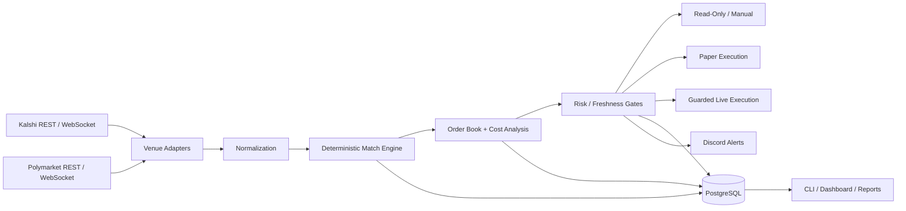
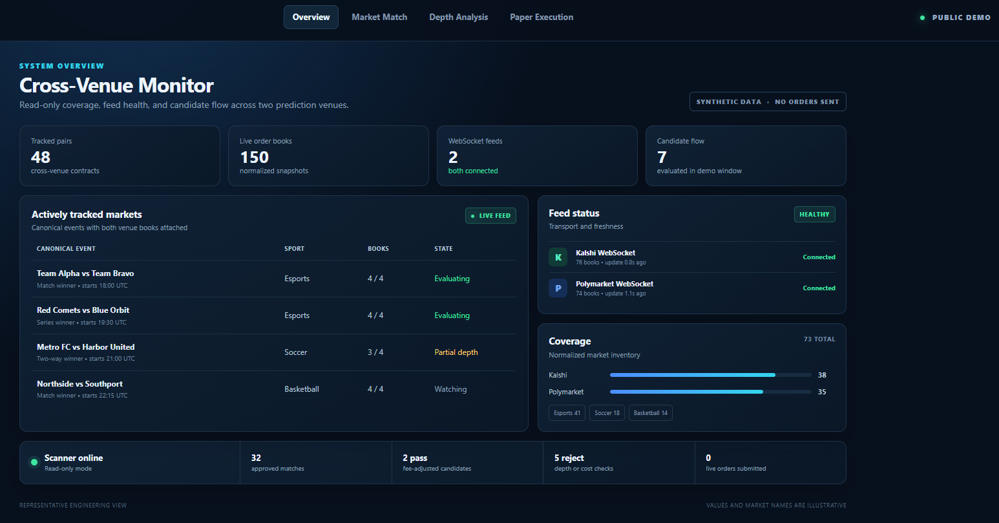
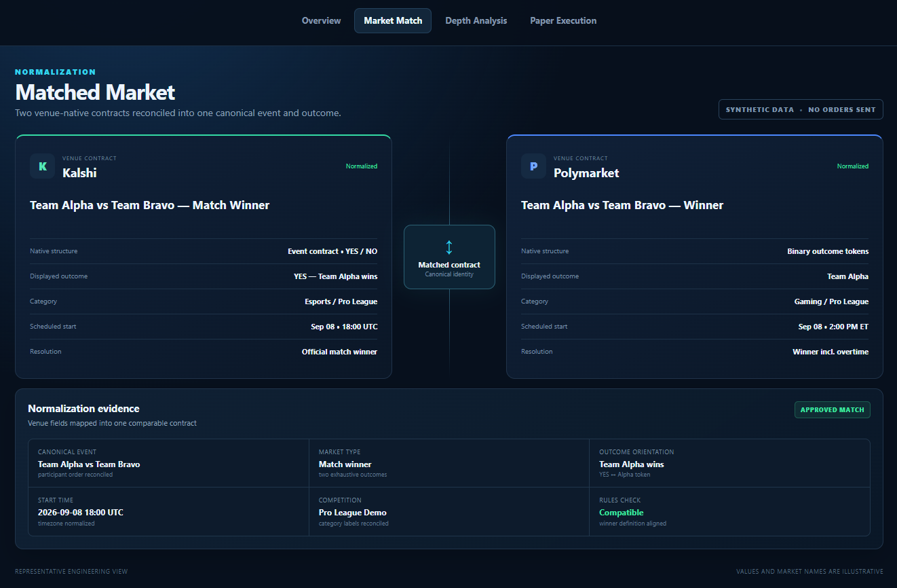
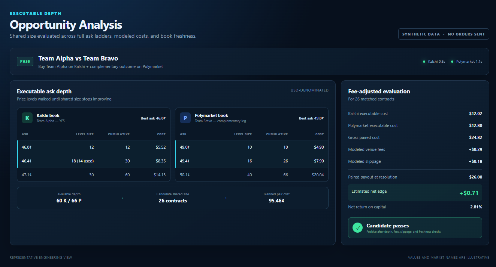
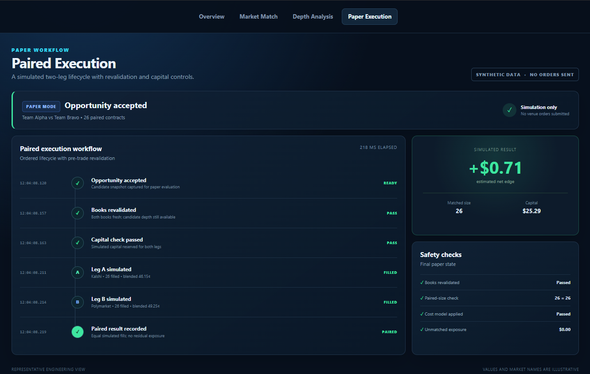
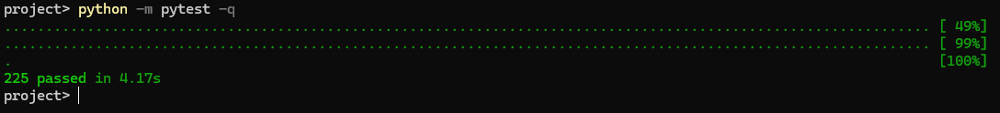

# Cross-Venue Prediction Market Arbitrage Engine

**A Python system for discovering, matching, and evaluating executable sports and esports opportunities across Kalshi and Polymarket.**

> **Source code is private.** This repository is a public project showcase containing architecture, screenshots, and selected technical details. Exact strategy thresholds, matching rules, sizing logic, credentials, account data, and execution configuration are intentionally excluded.

---

## What It Does

The system connects to **Kalshi** and **Polymarket**, normalizes venue-specific market data into a shared model, matches equivalent binary contracts, and evaluates cross-venue opportunities using executable order-book depth.

The pipeline considers:

- Venue-specific market and outcome formats
- Executable bid/ask depth
- Fees and modeled slippage
- Available liquidity
- Data freshness
- Configurable risk and capital checks

The project supports multiple operating modes:

- **Read-only scanning**
- **Discord-assisted manual review**
- **Paper execution**
- **Guarded live execution**, disabled by default and protected by multiple safety gates

The project is independent and is not affiliated with Kalshi or Polymarket.

---

## System Overview

At a high level, venue-specific integrations are separated from the shared market model and opportunity engine. This keeps the matching and pricing logic independent of either venue's raw API structure.

---

## Key Engineering Work

### Cross-Venue Normalization

Kalshi and Polymarket represent markets differently, so the system translates both into shared internal models for sports, teams, market type, outcomes, status, price levels, volume, liquidity, and market metadata.

Equivalent contracts are matched using deterministic rules rather than machine learning.

### Depth-Aware Opportunity Analysis

The engine evaluates executable order-book depth rather than relying on last-trade prices.

It can walk multiple price levels to determine a size that both venues can support, then evaluates the opportunity after venue fees, modeled slippage, freshness checks, and configurable risk requirements.

### Real-Time Market Data

Market discovery uses REST APIs while active market tracking can use authenticated WebSocket feeds with REST fallback and revalidation.

The application uses asynchronous I/O and bounded concurrency to retrieve venue data and order books efficiently.

### Execution Safety

Live execution is deliberately opt-in and disabled by default.

Before submission, the system can revalidate market data, simulate the exact two-leg fill, check available capital, and derive strict fill-or-kill limit orders.

Both initial legs are submitted concurrently. If fills become unequal, the executor includes rescue, unwind, and automatic-halt paths designed to avoid continuing with unresolved unmatched exposure.

### Persistence and Operator Tooling

PostgreSQL stores operational data including market observations, order-book snapshots, match decisions, opportunities, paper trades, alerts, and system events.

The project also includes:

- Rich terminal views
- A read-only local web dashboard
- Discord alerts
- HTML / CSV reports
- Feed and system-health diagnostics

---

## Technology Stack

**Language:** Python 3.12+

**Networking / APIs**
- HTTPX
- WebSockets
- Asyncio
- Authenticated REST and WebSocket integrations

**Data / Validation**
- Pydantic
- SQLAlchemy
- PostgreSQL
- Psycopg
- Alembic

**CLI / Operator Tools**
- Typer
- Rich
- Discord alerts
- HTML / CSV reporting

**Reliability**
- Tenacity retry handling
- Bounded concurrency
- Streaming reconnect logic
- REST fallback and pre-trade rechecks

**Development / Testing**
- Pytest
- pytest-asyncio
- Ruff
- MyPy
- Docker Compose for PostgreSQL

---

## Testing

The project has an automated test suite covering pricing, fees, order-book depth, market normalization, matching, risk checks, venue payloads, balances and positions, WebSocket handling, paper execution, live execution logic, and failure recovery.

**Current audit result: 176 tests passing.**

Tests use fake venue clients and simulated API responses so failure cases can be exercised without placing real orders.

Paper mode can also evaluate live market data while simulating fills instead of submitting trades.

---

## Measured Development Results

A completed sample scan:

- Normalized **73 markets**
- Built **642 candidate pairs**
- Approved **32 cross-venue matches**
- Completed in **59.72 seconds**

A separate runtime audit recorded:

- **48 tracked cross-venue pairs**
- **150 live order books**
- **2 WebSocket feed tasks**

These are development measurements, not claims of production capacity or profitability.

---

## Screenshots

> Screenshots in this showcase should use synthetic or heavily redacted data. Real balances, positions, order IDs, account identifiers, exact thresholds, and strategy settings are not published.

### 1. Market Coverage / Dashboard

Show the read-only dashboard with synthetic market names and aggregate system state.

<!--

  

-->

### 2. Cross-Venue Market Matching

Show a sanitized example of one Kalshi contract paired with its corresponding Polymarket contract.

<!--

  

-->

### 3. Order-Book / Opportunity Analysis

Show synthetic book depth and an evaluated opportunity, including fees or liquidity checks where visible without exposing private thresholds.

<!--

  

-->

### 4. Paper or Guarded Execution State

Show a paper-execution or sanitized execution-status view that demonstrates the workflow without exposing live account information.

<!--

  

-->

### 5. Automated Tests

A terminal screenshot of the passing test suite is useful supporting evidence.

<!--

  

-->

---

## Development Status

This is an **active-development local system**, not a continuously deployed production service.

It has been validated against live market data through read-only, paper, and limited guarded-execution runs.

Current limitations include incomplete automatic settlement/lifecycle handling and additional production-hardening work. Public documentation intentionally avoids claims of guaranteed profitability, risk-free execution, production uptime, or measured end-to-end trading latency.

---

## What Remains Private

The working source repository is kept private because the project contains strategy and execution details that are not necessary for demonstrating the engineering.

This showcase does not publish:

- API keys, signing keys, or credentials
- Wallet addresses or account identifiers
- Balances, positions, or raw trade history
- Exact arbitrage thresholds
- Exact market-matching rules
- Position-sizing logic
- Risk-limit values
- Execution timing or recheck policy
- Production configuration
- Full operational database schema

---

## About Me

**Greyson Denison-Fischer**  
Computer Science student at Central Michigan University · Graduating May 2027

[LinkedIn](https://www.linkedin.com/in/greyson-fischer/) · [GitHub](https://github.com/dgreyson3)
